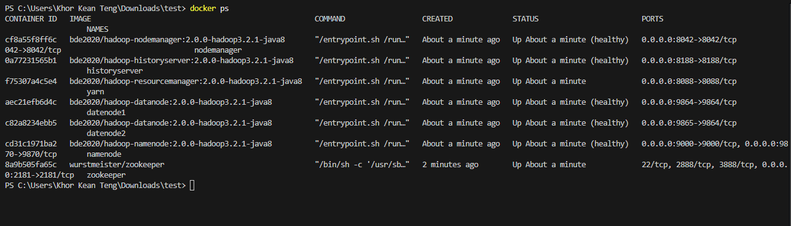
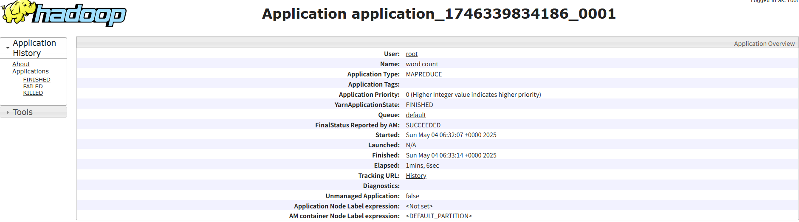

# MapReduce Using Docker

First of all, set up docker:

```bash
docker-compose up
```

Then check if all the services are running:

```bash
docker ps
```

You should see the following services running:



Then perform the following steps:

```bash
# change windows terminal to bash
docker exec -it namenode bash

# now you have access to the namenode container
pwd # check the current directory
cd /input # go to the input directory, you can put the input files in your local machine and they will show up here

# crate folder in hdfs
hdfs dfs -mkdir /user/root

# add the input file to hdfs
hdfs dfs -put /input/data.csv /user/root/data.csv

# run the mapreduce job
hadoop jar $HADOOP_HOME/share/hadoop/mapreduce/hadoop-mapreduce-examples-3.2.1.jar wordcount /user/root/data.csv /user/root/output

# check the output of the job
hdfs dfs -cat /user/root/output/*

# Or copy the output back to your local filesystem
hdfs dfs -copyToLocal /user/root/output /input/

```

The output can be viewed at /output in this repository.


# To check the status of the services, you can use the following links:



Make sure you use the link to check the resources consumption, memory, and CPU usage:
- http://127.0.0.1:9870/dfshealth.html#tab-datanode
- http://127.0.0.1:8188/applicationhistory

